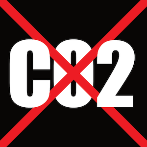

# Garmin CO2 Savings Datafield

[See it in the Connect IQ Store](https://apps.garmin.com/en-US/apps/229ff68d-6aa5-45da-aef9-f6568fb59ece).



## Usage

```
./bin/restart-simulator.sh
./bin/compile.sh
./bin/run-on-simulator.sh fr945
./bin/package-for-release.sh
```

## Generate developer keys

```
$ openssl genrsa -out developer_key.pem 4096
$ openssl pkcs8 -topk8 -inform PEM -outform DER -in developer_key.pem -out developer_key.der -nocrypt
```
